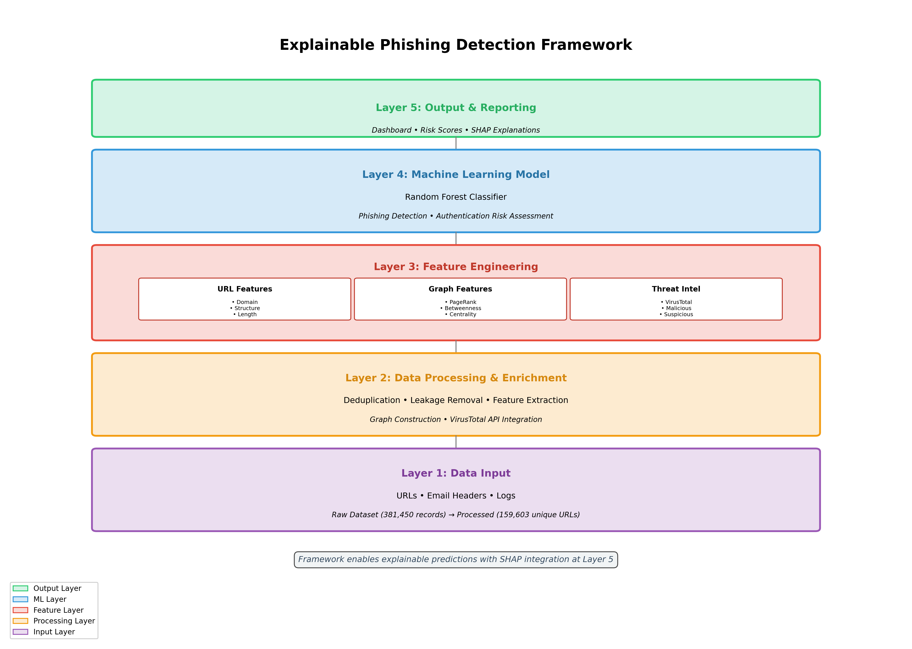

# Chapters 1-3 Figures Generation Guide

## Overview
This guide provides instructions for generating and using all figures for Chapters 1-3 of your research report.

## Generated Figures

### Chapter 1: Introduction

#### Figure 1.1: Explainable Phishing Detection Framework Architecture
- **Location**: `reports/chapters1-3/chapter1/fig1_1_framework_architecture.png`
- **Description**: Visual representation of the complete 5-layer framework
- **Key Components**:
  - Layer 5: Output & Reporting (Dashboard, Risk Scores, SHAP Explanations)
  - Layer 4: Machine Learning Model (Random Forest Classifier)
  - Layer 3: Feature Engineering (URL, Graph, Threat Intelligence)
  - Layer 2: Data Processing & Enrichment
  - Layer 1: Data Input
- **Usage**: Use in Introduction to provide high-level overview of framework architecture

---

### Chapter 2: Literature Review

#### Figure 2.1: Overview of Machine Learning Approaches in Phishing Detection
- **Location**: `reports/chapters1-3/chapter2/fig2_1_ml_approaches_overview.png`
- **Description**: Categorization of ML approaches used in phishing detection
- **Key Components**:
  - Traditional ML (Random Forest, SVM, Decision Trees, Naive Bayes)
  - Deep Learning (CNN, RNN/LSTM, Transformers, Autoencoders)
  - Ensemble Methods (Boosting, Bagging, Stacking, Voting)
  - Highlight of chosen approach (Random Forest + SHAP)
- **Usage**: Use in Literature Review to contextualize your methodology choice

---

### Chapter 3: Methodology

#### 3.1 System Architecture

##### Figure 3.1: Complete Framework Architecture with Five Layers
- **Location**: `reports/chapters1-3/chapter3/fig3_1_complete_five_layer_architecture.png`
- **Description**: Detailed breakdown of all five framework layers with components
- **Key Details**:
  - Each layer shows specific components and their functions
  - Data flow from bottom (input) to top (output)
  - Component counts: 19 features, 100 trees, etc.
- **Usage**: Main architecture diagram for methodology chapter

##### Figure 3.2: Data Flow Diagram from Input to Output
- **Location**: `reports/chapters1-3/chapter3/fig3_2_data_flow_diagram.png`
- **Description**: Step-by-step data transformation pipeline
- **Flow Stages**:
  1. Raw Data (381,450 URLs)
  2. Deduplication (159,603 unique URLs)
  3. Feature Extraction (19 features)
  4. Train/Test Split (80/20)
  5. Model Training (Random Forest)
  6. Predictions + SHAP Values
- **Usage**: Explain data processing workflow

##### Figure 3.3: Feature Extraction Pipeline
- **Location**: `reports/chapters1-3/chapter3/fig3_3_feature_extraction_pipeline.png`
- **Description**: Parallel feature extraction processes
- **Components**:
  - URL Analysis (7 features)
  - Graph Analysis (6 features)
  - Threat Intelligence (3 features from VirusTotal)
  - Feature vector concatenation (19 total features)
- **Usage**: Detail feature engineering approach

#### 3.2 Feature Engineering

##### Figure 3.4: URL Feature Extraction Process
- **Location**: `reports/chapters1-3/chapter3/fig3_4_url_feature_extraction.png`
- **Description**: Detailed URL feature extraction with example
- **Example URL**: `https://secure.login-verify.account-update.com/auth/login.php`
- **Extracted Features**:
  - domain_length: 38
  - url_length: 69
  - num_subdomains: 4
  - num_dots: 5
  - num_hyphens: 3
  - has_ip: 0
  - path_length: 15
- **Usage**: Demonstrate URL-based feature extraction methodology

##### Figure 3.5: Graph-Based Feature Analysis
- **Location**: `reports/chapters1-3/chapter3/fig3_5_graph_feature_analysis.png`
- **Description**: Graph network visualization and computed features
- **Features Shown**:
  - PageRank (0.247)
  - In-Degree (0)
  - Out-Degree (2)
  - Betweenness (0.333)
  - Closeness (0.571)
  - Clustering (0.0)
- **Usage**: Explain graph-based feature extraction

##### Figure 3.6: VirusTotal Intelligence Integration
- **Location**: `reports/chapters1-3/chapter3/fig3_6_virustotal_integration.png`
- **Description**: VirusTotal API integration workflow
- **Process Steps**:
  1. Extract URL
  2. Query VirusTotal API (batch mode)
  3. Parse JSON Response
  4. Create Features (vt_malicious, vt_suspicious, vt_harmless)
- **Example Output**: Malicious=42, Suspicious=7, Harmless=3
- **Usage**: Detail threat intelligence integration

#### 3.3 Machine Learning Models

##### Figure 3.7: Random Forest Classifier Architecture
- **Location**: `reports/chapters1-3/chapter3/fig3_7_random_forest_architecture.png`
- **Description**: Random Forest model architecture and voting mechanism
- **Components**:
  - Feature Vector Input (19 features)
  - 100 Decision Trees
  - Majority Voting mechanism
  - Final prediction output
- **Model Parameters**:
  - n_estimators=100
  - max_depth=20
  - min_samples_split=5
  - class_weight=balanced
- **Usage**: Explain Random Forest classifier architecture

##### Figure 3.8: Authentication Risk Model Components
- **Location**: `reports/chapters1-3/chapter3/fig3_8_auth_risk_model.png`
- **Description**: Authentication risk assessment model
- **Input**: Enron dataset authentication logs
- **Features**:
  - Login Time (hour of day)
  - Location (IP/Geo data)
  - Device (user agent)
  - Frequency (login rate)
- **Output**: Risk score 0-100 with thresholds:
  - Low: 0-30
  - Medium: 31-70
  - High: 71-100
- **Usage**: Explain authentication risk scoring methodology

---

## How to Generate Figures

### Method 1: Run the Generation Script

```bash
# Activate virtual environment
source .venv/bin/activate

# Generate all Chapters 1-3 figures
python generate_chapters1_3_viz.py
```

### Method 2: View Existing Figures

All figures are already generated and saved in:
```
reports/chapters1-3/
├── chapter1/
│   └── fig1_1_framework_architecture.png
├── chapter2/
│   └── fig2_1_ml_approaches_overview.png
└── chapter3/
    ├── fig3_1_complete_five_layer_architecture.png
    ├── fig3_2_data_flow_diagram.png
    ├── fig3_3_feature_extraction_pipeline.png
    ├── fig3_4_url_feature_extraction.png
    ├── fig3_5_graph_feature_analysis.png
    ├── fig3_6_virustotal_integration.png
    ├── fig3_7_random_forest_architecture.png
    └── fig3_8_auth_risk_model.png
```

---

## Integration with Report

### LaTeX Integration

```latex
\begin{figure}[h]
    \centering
    \includegraphics[width=0.9\textwidth]{reports/chapters1-3/chapter1/fig1_1_framework_architecture.png}
    \caption{Explainable Phishing Detection Framework Architecture}
    \label{fig:framework_architecture}
\end{figure}
```

### Word Document Integration

1. Open your Word document
2. Navigate to Insert → Pictures
3. Select the appropriate figure from `reports/chapters1-3/`
4. Adjust size (recommended: 90% of page width)
5. Add caption using Insert → Caption

### Markdown/HTML Integration

```markdown

*Figure 1.1: Explainable Phishing Detection Framework Architecture*
```

---

## Figure Characteristics

All figures are generated with:
- **Resolution**: 300 DPI (publication quality)
- **Format**: PNG with transparent backgrounds where appropriate
- **Color Scheme**: Consistent color coding across figures
  - Purple (#9b59b6): Input layer
  - Orange (#f39c12): Processing layer
  - Red (#e74c3c): Feature layer
  - Blue (#3498db): ML layer
  - Green (#2ecc71): Output layer
- **Font**: Arial/DejaVu Sans (readable at various sizes)
- **Size**: Optimized for print and digital viewing

---

## Customization

To modify any figure, edit the `generate_chapters1_3_viz.py` script:

```python
# Example: Change color scheme
layer1_color = '#9b59b6'  # Change this hex code

# Example: Adjust figure size
fig, ax = plt.subplots(figsize=(14, 10))  # Modify width, height

# Example: Change text
ax.text(5, 9.5, 'Your Custom Title', ...)
```

After making changes, regenerate:
```bash
source .venv/bin/activate
python generate_chapters1_3_viz.py
```

---

## Additional Figures Available

For Chapters 4-5 (Implementation and Results), use:
```bash
python generate_chapter4_viz.py
```

This generates:
- ROC Curve
- Performance Metrics Comparison
- Cross-Validation Scores
- Training/Test Split visualization
- Data Preprocessing Stats

---

## Troubleshooting

### Issue: Script fails to run
**Solution**: Ensure virtual environment is activated
```bash
source .venv/bin/activate
python generate_chapters1_3_viz.py
```

### Issue: Figures look blurry in Word
**Solution**: 
1. Ensure you're using the PNG files (not screenshots)
2. Set compression to "No compression" in Word
3. Use 300 DPI versions from the output folder

### Issue: Colors don't match between figures
**Solution**: All figures use consistent color palette. If colors appear different, check your viewer's color profile settings.

---

## Summary Table

| Figure | File | Chapter | Section | Purpose |
|--------|------|---------|---------|---------|
| 1.1 | fig1_1_framework_architecture.png | 1 | Intro | Framework overview |
| 2.1 | fig2_1_ml_approaches_overview.png | 2 | Lit Review | ML landscape |
| 3.1 | fig3_1_complete_five_layer_architecture.png | 3 | 3.1 | Detailed architecture |
| 3.2 | fig3_2_data_flow_diagram.png | 3 | 3.1 | Data flow |
| 3.3 | fig3_3_feature_extraction_pipeline.png | 3 | 3.1 | Feature pipeline |
| 3.4 | fig3_4_url_feature_extraction.png | 3 | 3.2 | URL features |
| 3.5 | fig3_5_graph_feature_analysis.png | 3 | 3.2 | Graph features |
| 3.6 | fig3_6_virustotal_integration.png | 3 | 3.2 | VT integration |
| 3.7 | fig3_7_random_forest_architecture.png | 3 | 3.3 | RF model |
| 3.8 | fig3_8_auth_risk_model.png | 3 | 3.3 | Auth risk model |

---

## Quick Reference

**Generate all figures**: `python generate_chapters1_3_viz.py`  
**Output directory**: `reports/chapters1-3/`  
**Total figures**: 10 (1 for Ch1, 1 for Ch2, 8 for Ch3)  
**Format**: PNG, 300 DPI  
**Total size**: ~2.1 MB

---

*Generated for Phishing Risk Detection Project*  
*Last updated: 2025-11-15*
